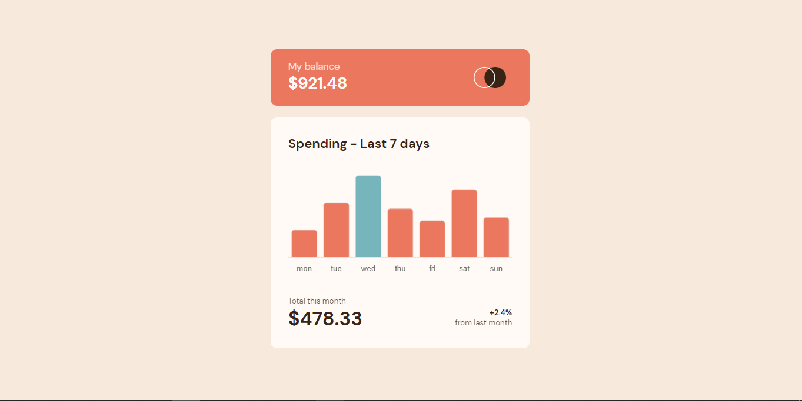

# Frontend Mentor - Expenses chart component solution

## Table of contents

- [Overview](#overview)
  - [The challenge](#the-challenge)
  - [Screenshot](#screenshot)
- [My process](#my-process)
  - [Built with](#built-with)
  - [What I learned](#what-i-learned)
  - [Continued development](#continued-development)
  - [Useful resources](#useful-resources)
- [Author](#author)

## Overview

### The challenge

### Screenshot

## My process

### Built with

- Semantic HTML5 markup
- CSS custom properties
- Flexbox
- CSS Grid
- Mobile-first workflow
- Chart.js

### What I learned

I learned how to use a javascript library called chart.js and it is awesome.

### Continued development

Google searches

### Useful resources

- [Stack Overflow](https://www.stackoverflow.com) - Stack Overflow

## Author

- George Asiedu - [@george5-star](https://www.frontendmentor.io/profile/george5-star)
